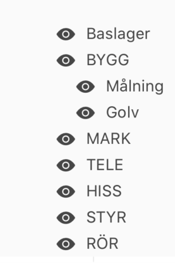
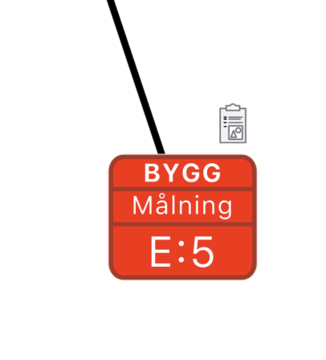

# Layers
#plantrail/blueprints


## IdentifierPrefix in other datasets
Datasets for reports and DDP calculates identifer_full by concatenating layer_mnemonic to the identifier. This needs to be replaced by simply reading identifier_full from controlpoint.

- [ ] DDP Datasets
- [ ] ReportDatasets
- [ ] Check for other places `select * from find('identifier_full')`

- [ ] migrate value of labelFieldName to specific field (maybe labelText)
- [ ] Let label show "labelText" in infoField2

```  if (labelDef) {
    const labelFieldName = labelDef.getIn(['fields', 0, 'fieldName']);
    labelText = controlpoint.getIn(['properties', labelFieldName]);
```


## Identifier prefix in the app
From now on the labelText should be fetched from controlpoint.identifierFull.

IdentifierFull is fetched from the server along with other controlpoint properties, but we need to handle the off-line case. I.e. the app needs to assign identiferFull locally based on the controlpointType settings for each project.

- [x] Sync identifierFull from the API
- [x] Update identifier locally (offline) as per controlpointTyp settings

## Identifier prefix in the database
Identifier prefix can be applied from multiple sources depending on project_controlpoint_type.identifier_prefix_type_id:
0. No prefix
1. Layer mnemonic is used as prefix
2. Deviation mnemonic is used as prefix (example: inspection codes B,E,A,U..)
3. Sequence mnemonic, i.e. a static mnemonic for the whole sequence
4. ControlpointType mnemonic, i.e. a static prefix for a specific controlpointType

The prefix is stored in controlpoint.identifier_prefix. Depending on the selected source we might need to batch update controlpoints on certain events.

An initial prefix is set via create_controlpoint if type is one of (1,3,4)

If type is one or two, the prefix can also be updated via process_journal_item, i.e. if layer is changed (1) or a deviation with a mnemonic is created (3).

N.B. If a layer mnemonic is changed to null, the prefix is cleared if type=1

N.B. If a deviation mnemonic is set to null, nothing is updated. This is because a controlpoint will probably have many deviations and not all of them will have a mnemonic. Deviations can only set a prefix, not unset.

* When type=1 and a layer mnemonic is updated
* When type=2 and a deviation mnemonic is updated
* When type=3 and a sequence mnemonic is updated
* When type=4 and a controlpointType mnemonic is updated
* When the prefix_type is changed

- [x] If a layer mnemonic is updated, we need to update every identifier_prefix for controlpoint on this layer in this project where the controlpoint_type has identifier_prefix_type_id = 1 in project_controlpoint_type.

```SELECT main.update_identifier_prefix_from_layer_mnemonic(
  _user_account_id => 1,
  _project_id => 2,
  _controlpoint_type_id => null,
  _layer_id => 9
);
```

- [x] If a deviationMnemonic is updated, we need to update every identifier_prefix for controlpoints in every project where the controlpoint_type has identifier_prefix_type_id = 1 in project_controlpoint_type.

```
SELECT main.update_identifier_prefix_from_deviation_mnemonic(
  _user_account_id => 1,
  _project_id => null,
  _controlpoint_type_id => null
);
```

- [x] If he setting identifier_prefix_type_id changed to 1 for a controlpoint_type in a project, we need to update all identifier_prefix for all controlpoints of the updated controlpoint_type within the project with the corresponding layer_mnemonic, for all layers in the project.

```SELECT main.update_identifier_prefix_from_layer_mnemonic(
  _user_account_id => 1,
  _project_id => 2,
  _controlpoint_type_id => 111,
  _layer_id => null
);
```

- [x] If the setting identifier_prefix_type_id changed to 2, we need to update all identifier_prefix for all controlpoints of the updated controlpoint_type within the project with the last known "mnemonic" in the deviations for each controlpoint.

```
SELECT main.update_identifier_prefix_from_deviation_mnemonic(
  _user_account_id => 1,
  _project_id => 1000,
  _controlpoint_type_id => 111
);
```


**ToDo**
- [ ] Check usage of sequence_prefix/suffix `(select * from find('sequence_prefix')`
- [ ] drop column project_sequence.sequence_prefix
- [ ] drop column project_sequence.sequence_suffix

## process_journal_item
- [x] process_journal_item needs to set identifier_prefix to the layer mnemonic if a new layer_id is set and is_use_layer_mnemonic=true. 
- [x] Otherwise the function needs to set identifier_prefix to **new_identifier_prefix** from the journal_item

## create_controlpoint
- [x] create_controlpoint need to apply identifier_prefix from the layer_mnemonic is is_use_layer_mnemonic = true

N.B. No need to update identifier_prefix due to journal_item at this point, since the inception of a controlpoint happens without a journal_item. Only layer can be known at this point.


## Layer hierarchies




Todo:
- [x] Shape-lib: Multiline label titles based on titles-array
- [x] App: same as shape-lib
- [ ] const calcLabelText = ({layerMnemonic}).. change to "identifierPrefix"
- [ ] getProjetcts -> ensure correct layer structure
- [ ] app: add/remove layers
- [ ] app: layer selection, multi-row + segmented hierarchy
- [ ] Implement identifier prefix, i.e. via selection from segmented
- [ ] implement permission for moving controlpoints between layers

Layer selection
Segmented hierarchy automatically generated from layer structure.

- [ ] acl_calc, inherit layer roles
- [ ] apply_project_template, add controlpointTypes with company defaults
- [x] create missing project_controlpoint_type in get_next_seq, should add company defaults

- [x] adjust click target in the app to mimic the real size of the label
- [ ] implement look in shapelib for large icons
- [x] implement new shapelib in app

- [ ] select * from find('parent_layer_id');


## Todo
- [ ] Controlpoint preview
- [ ] JournalIem preview
- [x] Report filter
- [x] Layer sort order
- [ ] Upgrade auto-flush ACL
- [ ] Save "visibleLayers" in drawingUserSettings so the user gets back to the same visibility setup as when he/she left the drawing.

## Project controlpointTypes
Each project has a specification on which controlpointTypes can be used. Only specified controlpointTypes should be included in the tool menu.

As of 2022-07-13, there is no UI for specifying which controlpointTypes can be used in each project. The current workaround it to pretend that all controlpointTypes, to which the user has creation rights in any of the project layers, can be used.

## Visible layers
The user can hide/reveal each defined layer in the drawings. This sets a filter for which controlpointTypes will be visible.

## Layer access rights
Access rights can be assigned per layer by granting a user roles on specific layers. In order to achieve layer specific access rights, the user cannot have any roles on company- or project-level, since such roles would be inherited and automatically give access to all layers.

## Default layer per controlpoint-type
Each controlpointType has its own configuration in each project. The config specifies what sequence scheme to use and the id for each sequence. The config can also hold a setting for default layer. Default layer should be used as suggested layer of the users ACL permits this.

## Controlpoint tool menu in the app
The controlpoint tool menu should show all controlpointTypes to which the user has creation-permission. The visible controlpoint tools are dependent on both the users access rights and the currently visible layers.

The tool menu should also show the next sequence number as well as a suggested layer. Sequence number is selected based on the specified sequence scheme for each controlpointType in each project. The suggested layer must take some prerequisites into account, se below.

### Calculating the tool menu visibility
- [ ] ControlpointType creation permission is analysed for each visible layer. If permission is granted to any of the visible layers, the tool should be visible
- [ ] If a controlpointType has a default layer specified, this layer should be used as default, but only if the user has creation permission on that layer. Otherwise layer suggestion will be calculated as if no default layer where specified.

N.B. defaultLayer should be used as suggestion even if the specified layer is not visible (as long as the user has creation rights on this layer.
- [ ] If no default layer is specified, the suggested layer should be the first visible layer where the user has creation rights.

#### Pseudo code

The process:
```
const creatableControlpointTypes = Set()
visibleLayers.forEach(layer => {
  layer.createControlpointTypes.forEach(controlpointType => {
		if(!creatableControlpointTypes.has(controlpointType)) {
 			creatableControlpointTypes.add(controlpointType)
		}
  })
})


```


#### 1. Build a list with creatable controlpointTypes
```
[
	{
		controlpointType,
		createOnLayerIds: [1,2]
		defaultLayerId,
      sortOrder
  }
]
```

#### 2. Filter the list based on visible layers
```
visibleLayerIds = [1,2]
creatableControlpointTypes.map(item => {

	const applicableOnLayerIds = visibleLayerIds.filter(visibleLayerId => {
		item.createOnLayerIds.includes(visibleLayerId)		
	})

	let currentDefaultLayerId
	if(applicableOnLayerIds.length > 0) {
  //If defaultLayer is specified and this layer is applicable
  //use defaultLayer, otherwise use the first applicable layer
  if(item.defaultLayerId && applicableOnLayerIds.inclueds(item.defaultLayerId)) {
		currentDefaultLayerId = item.defaultLayerId;
  } else {
		currentDefaultLayerId = applicableOnLayerIds[0]
  }

	sequence..

  }

  return {
		...item, 
		applicableOnLayerIds,
  		currentDefaultLayerId,
		isCurrentlyCreatable
	}
})
```


visibleTools = least common denominator between:
* allControlpointTypes
* projectControlpointTypes per layer
* creatableControlpointTypes (ACL) per layer
* visibleLayerIds (creatable for each layer is checked)

defaultLayerId = if (user has creation rights in specifiedDefaultLayer)  {
  specifiedDefaultLayerPerControlpoint
} else {
  first visible layer with creation rights for the controlpointType
}
 

## Test case
The visibility of a controlpointType tool can be complicated to calculate. Here is a test case for verifying the calculation.

N.B. depending on the assigned default layer for each menu item, a corresponding sequence must also be selected. The defined sequence scheme for each controlpointType will dictate which sequence to use. If the sequenceScheme = 4, an individual sequence is used for each layer, i.e. if a layer is hidden and another default layer is assigned, the next sequence number displayed in the controlpoint menu might change as well.

### AllLayers
L1, L2, L3
*The project has three layers defined.*

#### ProjectControlpointTypes
CT1, CT2, CT3, CT4, CT5
*There are five controlpointTypes specified for usage in this project*

#### VisibleLayers
✅ L1
✅ L2
⛔️ L3 *The user has hidden layer L3.*

### Layer ACL
✅ L1.CT1 canCreate = true
✅ L1.CT2. canCreate = true
⛔️ L1.CT3. canCreate = false
✅ L1.CT4. canCreate = true
⛔️ L1.CT5. canCreate = false

✅ L2.CT1 canCreate = true
✅ L2.CT2 canCreate = true
⛔️ L2.CT3. canCreate = false
✅ L2.CT4. canCreate = true
✅ L2.CT5. canCreate = true

✅ L3.CT1. canCreate = true 
✅ L3.CT2. canCreate = true
✅ L3.CT3. canCreate = true
⛔️ L3.CT4. canCreate = false
✅ L3.CT5. canCreate = true

*Layer ACL is specified per controlpointType for each layer. User can create a controlpointType when canCreate = true*

### Default layers
CT1: null
CT2: L3
CT3: null
CT4: L2
CT5: null

*Default layers are specified for CT2 and CT4*

#### Tool menu
##### CT1
- [ ] Active *(user can create CT1 on one or more visible layers)*
- [ ] Default layer = L1 *(the first visible layer)*

##### CT2
- [ ] Active *(user can create CT2 on one or more visible layers)*
- [ ] Default layer = L1 *(the first visible layer with creation rights, the specified default L3 is not used since L3 is hidden)*

##### CT3
- [ ] Inactive *(user can only create CT3 on L3, but L3 is hidden)*

##### CT4
- [ ] Active *(user can create CT3 on both visible layers L1 and L2)*
- [ ] Default layer = L2 *(as per specified default since L2 is visible)*

##### CT5
- [ ] Active *(user can create CT4 on L2 which is visible)*
- [ ] Default layer = L2 *(the first visible layer with creation rights)*