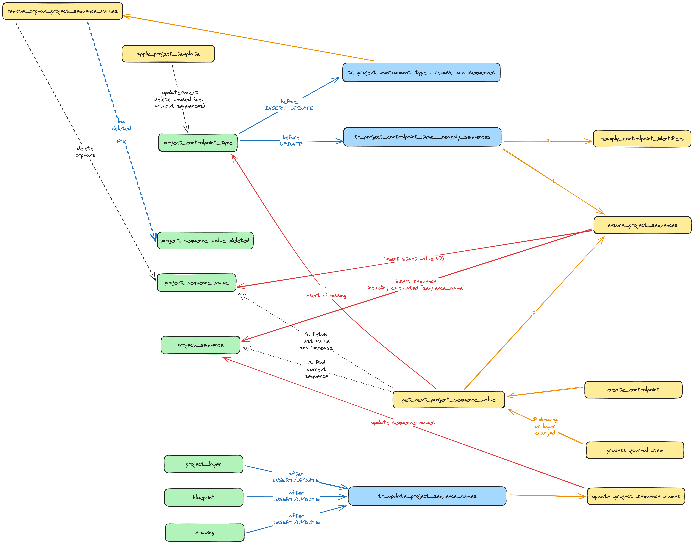

# ProjectSequences
#plantrail/projects


## N.B.
- [ ] sequence_scope_id must be the same for all grouped controlpointTypes

## New sequence structure
- sequence_id is now stored in controlpoint


## Database structure

All project sequences are created and altered via `project_controlpoint_type`. This table defines how each controlpointType should be handled within the project. Specifically, the following fields controls how sequences are defined:
- sequence_scope_id -> numbering per project, per drawing, per layer or per layer+drawing
- sequence_group_key -> for grouping multiple controlpointTypes to the same sequence
- default_sequence_prefix ->
- default_sequence_suffix -> 

Changes in project_controlpint_type are captured by `tr_project_controlpoint_type__reapply_sequences` on **UPDATE**. If scope_id or group_key are changed, `ensure_project_sequences` is called for the project and new identifiers are applied for the controlpointType on the whole project via `reapply_controlpoint_identifiers`.

A project_sequence is always associated with a specified project and a specified controlpointTypeId. 

More than one project_sequence entries can point to the same project_sequence_value, i.e. multiple sequence definitions can share the same sequence values. E.g. two separate controlpointTypes can share the same sequence value series. The sharing is simply defined by setting multiple `project_sequence.sequence_id` to the same value. These values are never set manually, but are automatically assigned via changes in project_controlpoint_type.

project_sequence has an id column which is a convenience primary key. There actual data integrity is protected by a unique constraint on:
`project_id, 
controlpoint_type_id, 
COALESCE(drawing_id, 0), 
COALESCE(layer_id, 0))`
This index ensures that `find_project_sequence` is able to find the correct sequences with this query:
``` sql  
SELECT DISTINCT
  ps.sequence_id,
  ps.sequence_scope_id,
  ps.mnemonic
FROM main.project_sequence ps
WHERE ps.project_id = _project_id
AND (_controlpoint_type_id IS NULL OR ps.controlpoint_type_id = _controlpoint_type_id)
AND (_drawing_id IS NULL OR ps.drawing_id IS NULL OR ps.drawing_id = _drawing_id)
AND (_layer_id IS NULL OR ps.layer_id IS NULL OR ps.layer_id = _layer_id);
```

A check constraint ensures correct input based on scope (project_sequence_check_scope_compliance):
- `layer_id IS NULL` and `drawing_id IS NULL` if `scope = 1` (project)
- `layer_id IS NULL` and `drawing_id IS NOT NULL` if `scope = 2` (drawing)
- `layer_id IS NOT NULL` if `scope = 3` (layer)
- `layer_id IS NOT NULL` and `drawing_id IS NOT NULL` if `scope = 4` (drawing+layer)

### Flow chart
The below flow chart shows the intricate machinery for keeping the integrity of project sequences.

Key take aways:
- get_next_project_sequence_value always ensures that both project_controlpoint_type and project_sequence exists.
- when a sequence is created by ensure_project_sequences, an initial name is calculated for the sequence
- sequence_names will be updated via tr_update_project_sequence_names if drawing- or layer names are updated
- ensure_project_sequences is also called when a new project_controlpoint_type is updated
- N.B. get_next.. might INSERT into project_controlpoint_type. This will not trigger tr_project_controlpoint_type__reapply_sequences, hence get_next.. calls ensure_project_sequences by itself.
- N.B. new layer or new drawing will not trigger ensure_project_sequences, since this will be handled when the first controlpoint is created on or moved to the layer or drawing.



### project_sequence
The project_sequence table holds sequence definitions for all projects.
### project_sequence_value
The project_sequence_value table holds the actual “last_value” for each sequence. 


- [ ] snurra för att populera alla controlpoint.sequence_id
- [ ] säkra upp så alla vägar uppdaterar sequence_id
  - [ ] ändrad sequence i project_controlpoint_type 
  - [ ] ny eller ändrad controlpoint (t.ex bytt lager)
- [ ] när ny sequence skapas ska den få sequence_name (kanske i ensure...) 
- [ ] när drawing eller blueprint eller layer ändrar namn ska seqience_name uppdateras
- [ ] hantera när ett sequence_id används av flera sequence-definitioner


- [ ] Add SOCKET_SYNC_CONST to SDK
- [ ] Create notify trigger for main.sequence
- [x] Add projectId to main.sequence (new name: project_sequence_value)
- [ ] Add sync handler for sequence in socketServer
- [x] Add projectId in ensure-sequence..
- [ ] Add sequenceDefinition to get_projects
- [ ] Implement usage of sequences in the app
- [ ] Implement sequence_deleted


## Migrate from sequence to project_sequence_value (prod functions)
### New (copied) functions
- [x] get_next_sequence_value => get_next_project_sequence_value

### Altered functions
- [x] ensure_project_sequences
- [x] get_project_sequences_complete

## Use new functions
- [x] process_journal_item
- [x] create_controlpoint

