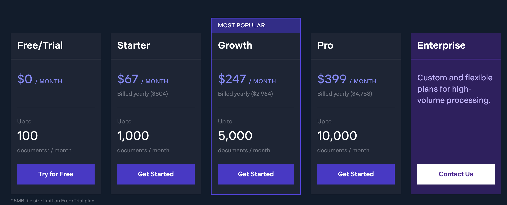

# Ritningsimport

#plantrail/blueprints
#dev/svg
#dev/skia
#dev/pdf

## Återstår bl.a.
- [ ] jpg/png/tiff
- [x] bättre tumnaglar
- [ ] hela projektformuläret (kan testas i formulär-verkstan)
- [x] list-sorteringar (bokstavsordning på företag, blueprints)
- [ ] rotering av ritningar på servern
- [ ] beställa högre upplösning
- [ ] skapa projekt-tumnagel
- [ ] visa riktiga ritningarna i webappen
- [ ] jobba med riktiga ritningar (byta namn, nr, rotera, beställa högre upplösning)
- [ ] skapa ritnings-lager i projekten
- [ ] bestämma vilka kontrollpunktstyper som får skapas i ett projekt
- [ ] ställa in kontrollpunktstyperna (grafik, numrerings-koncept, prefix i flaggorna, etc)
- [ ] projekt-rättigheter
- [ ] text-analys och förslag till inmatningsfälten
  - [ ] vid single page pdf är ofta filnamnet samma som ritningsnumret
- [ ] översättningar

**Martin**
- [x] sortorder in blueprint list
- [x] sortorder in company list
- [ ] project form
- [x] act on deleted/revoked project if “active”
- [x] refresh blueprint-list every time this is opened (blueprint revisions)
- [ ] translations

**Micke**
- [x] better thumbnails
- [ ] single-file-re-render (processType 102)
- [ ] existing blueprint-re-render (processType 201)
- [x] deleted blueprints should not be included in /blueprints

## Delprocesser på worker-servern
### Möjliga indata
- flersidig PDF
- ensidig pdf
- jpg/png/tiff/heic/webp

### Önskade åtgärder
- Uppladdning/konvertering av fil första gången
- Ändra rotation
- Ändra upplösning
- Ändra transform
- Ändra filter
### Processer

- Om upload-filen är “single page” används samma fil som page-original
- Om upload-filen är multi-page skapas nya page-filer av pdfium explode

Kategorisering av upload-filer som kräver olika hantering:
**[1]** upload-fil är single-page PDF (vector eller embedded pixels)
**[2]** upload-fil är single page, men inte JPG -> page_original = png/heic/etc (resized to cap, 8000x8000)
**[3]** upload-fil är JPG -> page_original = jpg (resized to cap 8000x8000)

**[10]** upload-fil är multi-page PDF (vector eller embedded pixels)
**[11]** framtid: upload-fil är BIM (dvs “flersidig”) (alltid vector, kräver ifc-bibliotek för att extrahera ritningar). Dalux kallar extraherade ritningar för “Auto drawing”

upload-typ 10 och 11 kan behövas flera gånger för att ta fram ej processade pages.
**Alltså:** Vi behöver bara ha koll på “originalFileType” samt “isMultiPage”

Filtyper att spara per fil för “pages”:
- original -> oförändrad originalfil (exploded pdf, png, tiff, jpg)
- mediumRes
- thumbnail
- lowRes

A. ladda ner upload-fil att processa från S3 eller använd lokal cache
A2. ladda ned page-fil (original) att processa från S3 eller använd lokal cache
B. Analysera innehåll i PDF
C. Skapa filer i file-tabellen för alla filer som inte redan finns
C2. Uppdatera file-tabellen
D. Skapa fileRefs om dessa saknas
E. Skapa medium-upplösning från PDF-sidor mha pdfium
F. Skapa thumbnail från PDF-sidor mha pdfium
G. Explode singel PDF-sidor från PDF
H. 

Alla processer:
- ladda ner originalfil eller använd lokal cache

### Ny fil uppladdad (via /uploads -> S3)
- fileTypeId = satt vid uppladdning
- originalFileTypeId = fileTypeId satt vid uppladdning
- Skapa fileProcess-jobb med type = 101

**Workern hanterar type 101**
- Ladda ner originalfil eller använd lokal cache

- Analysera fil
  - PDF:
    - analysera PDF
      - skapa pages-array
        - sectionId=1 för ritningar
        - sectionId = 2 för icke ritningar
        - pendingFileGuid sätts om sectionId <> 1
        - fileGuid sätts om sectionId = 1
      - if pageCount === 1, page.fileGuid = uploadFile.fileGuid
      - skapa pageFiles-array
  - Inte PDF:
    - skapa pages-array med ett element
    - page.fileGuid = uploadFile.guid
- Skapa file-records OM pageCount > 1
  - Om pageCount = 1 finns inga pageFiles eftersom pageFile = uploadFile
  - Skapa file-records för alla pageFiles-objekt 
- Skapa fileRefs för alla pages-objekt 
  - sätt pendingFileGuid och fileGuid från page-objekt
- Processa filer:
  - PDF:
    - pdfium 4000 för alla pageFiles 
    - pdfium 120 för alla pageFiles
    - if pageCount > 1: pdfium explode för alla pageFiles
  - Inte PDF:
    - If original > 8000px: Sharp resize 8000
    - Sharp resize 4000
    - Sharp resize 120
- Uppdatera file-record
  - fileTypeId = JPG
  - if pageCont > 1: update pageCount
  - medium_resolution = 4000

### Ändra sectionId till 1 i redan processad uppladdningsfil
Detta kan bara hända i flersidiga PDF:er, eftersom alla enkelsidiga upload-filer redan har en page med “framkallad” jpg.
- skapa fileProcess-jobb med type = 102 med pages-array som jobb-info, inkl. pending_file_guid

**workern hanterar type 102**
- Ladda ner originalfil eller använd lokal cache
- skapa pageFile med pending_file_guid från jobbet

A-B-C-D-E-F-G

Enskild sida i upload-pdf ändrar status så vi behöver konvertera till jpg
A- - -C - - -E-F-G
C: skapa file-record.. Bara om den inte redan finns

#### Enskilda “page”-filer behöver göras om
Enskild pdf page behöver genereras om pga rotation, upplösning, transform eler filter
A2- - -C2 - - -E-F- -

jpg/png/etc behöver genereras om pga rotation, upplösning, transform eler filter
A2- - -C2 - - -E-F- -

#### Enskilda “blueprint”-filer behöver göras om
Enskild pdf page behöver genereras om pga rotation, upplösning, transform eler filter
A2- - -C2 - - -E-F- -

jpg/png/etc behöver genereras om pga rotation, upplösning, transform eler filter
A2- - -C2 - - -E-F- -

## Brainstorm med Martin 2023-09-12

1. import one or more PDF/JPG/PNG/TIFF files in browser
2. upload to S3??
3. work with the files
   1. mark pages for blueprint creation
   2. fill in metadata form for each marked page
4. Create blueprints on server
   1. upload metadata to API (get upload urls in response)
   2. extract jpg from pdf pages (1x120px and 1x4000px)
   3. extract single pdf page for each blueprint
   4. upload jpg and single page pdf files to S3 (upload link

	
																								
API as of today:
1. create file /files
2. upload file to S3
3. mark file as uploaded
4. create blueprint and ref the file
5. create drawing and ref the blueprint

### HEIC files
[GitHub - catdad-experiments/heic-convert: 🤳 convert heic/heif images to jpeg and png](https://github.com/catdad-experiments/heic-convert)

### UI-ritningsfunktioner
- [ ] Skapa ritning från PDF-sida
- [ ] Skapa ritning från bildfil
- [ ] Rotera ritning i PDF eller bildfil
- [ ] Mata in metadata för ritning
- [ ] Redigera metadata för ritning
- [ ] Visa ritningslista inkl tumnaglar inför redigering eller bara för överblick
- [ ] Dubblettkontroll av ritningsnamn
- [ ] Skapa revisionsritning
- [ ] Ladda in källfil från lokal disk
- [ ] Använda projektfil som källfil för ritningsimport
- [ ] Kalibrera ritning
- [ ] Markera ritningsområden
- [ ] Radera ritning (om det inte finns kontrollpunkter på den)

## funktioner bakom UI
- [ ] Konvertera pdf-sida till 4000px samt 120px jpg
- [ ] Plocka ut sida ensidig som pdf-fil
- [ ] Ladda upp filer till S3

## PSPDF Processor
Converting blueprint PDFs to JPG

Poppler -> pdftocairo
- [ ] How does processor differ from pdftocairo?
- [ ] Does Processor use pdftocaro under the hood?

Prices for the following:
- [ ] cloud based conversions, i.e. API calls to PSPDF's servers
- [ ] on premise Docker container in our AWS private network
- [ ] on premise Lambda function in our AWS network
- [ ] on premise hosted inside of a proprietary Docker image, called from  Node.js.

PDF to image API:
[PDF to Image API: Convert PDF to JPG, PNG, WebP | PSPDFKit](https://pspdfkit.com/api/pdf-to-image-api/)

On premise via Docker?
docker run --rm -t -p 5000:5000 pspdfkit/processor:latest

### Cost
### Performance

**Indata**
1. Filer via mail
- [ ] Flera filer kan finnas i samma mail
- [ ] Vissa kanske ska bli ritningar
- [ ] Vissa kanske ska användas till snippets på projekt eller företagsnivå
- [ ] Vissa kanske ska läggas i projektbiblioteket för länkning i rapporter

2. Bilder från kameran
- [ ] Förmodligen en ritning i taget, typ utrymningsplan

3. Redan importerade filer i projektets dokumentarkiv
- [ ] Om man har sparat filer från mail till projektets filarkiv kanske man i efterhand vill skapa ritningar från dessa.

## UX
### Webapp
* Upload files (drag/drop or select one or multiple files)
* If file is zip, unzip
* If file is pdf export images
* If file is png or tiff, convert to jpg
* Present jpg thumbnails in a list
* User selects images for blueprint creation

## SVG blueprints
In the future we might support vector based blueprints. Either via PSPDF or Skia. Skia will make us much more free to develop what we want. In the Skia scenario we need to convert input PDF files to SVG.

PDF-SVG converter to evaluate:
[dvisvgm: About](https://dvisvgm.de/)
